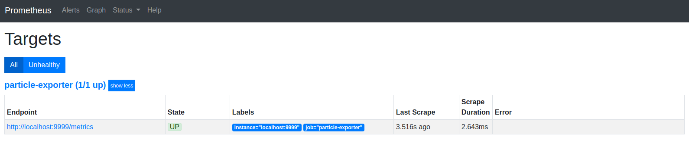

# Golang-based Prometheus Exporter for Particle

Scratching a curiosity over a glass of wine this evening... This is a Prometheus Exporter for Particle. When given your access token, it will query Particle's service, enumerate your devices and the devices' diagnostics. It will then render these using Prometheus' Metrics Exposition format on an endpoint (`http://localhost:9999/metrics` by default) that can be configured as scrape endpoint for a Prometheus server. Then, the limit is your imagination. Then you could graph the results in Grafana...

## Caveats

This is a couple of hour's work! It is very rough. It works. It only enumerates `/devices` and `/diagnostics/${DEVICE}`. It should be straightforward to continue to extend to other Particle APIs. There's much refactoring that needs to be done!

Feedback always welcome.

## Docker Compose

You can run everything using Docker Compose.
```bash
TOKEN=[[PARTICLE-TOKEN]]
docker-compose up
```

**NB** This requires the prometheus.yml file to reference the exporter as `particle-exporter:9999` rather than `localhost:9999`

## Prometheus

prometheus.yaml:
```YAML
scrape_configs:
  - job_name: "particle-exporter"
    honor_labels: true
    static_configs:
      - targets: ["localhost:9999"]
```
Then:
```bash
docker run \
--interactive --tty \
--net=host \
--volume=${PWD}/prometheus.yml:/etc/prometheus/prometheus.yml \
prom/prometheus
```
**NB** Prometheus needs `--net=host` to most easily access the Particle Exporter running on the same host.

## Particle Exporter

```bash
ENDPOINT=:9999 # Default
PATH=metrics # Default
TOKEN=[[PARTICLE-TOKEN]]
```

Either:
```bash
docker run \
--interactive --tty \
--publish=9999:9999 \
dazwilkin/particle-exporter@sha256:a1c6b370bbe7afd60cebbefcfad54922c4f767a0c566b2410745acee26993120 \
  --token=${TOKEN}
```
Or:
```bash
GO111MODULE=on \
go run github.com/DazWilkin/particle-exporter \
--endpoint=${ENDPOINT} \
--path=${PATH} \
--token=${TOKEN}
```
Or:
```
GO111MODULE=on \
go run github.com/DazWilkin/particle-exporter \
--token=${TOKEN}
```

## Browse

http://${ENDPOINT}/${PATH}

```
# Hello Freddie# HELP freddie A simple header for this exporter.
# TYPE freddie counter
freddie 1
# HELP particle device information.
# TYPE particle_connected counter
particle_connected{core_id="123456789012345678901234"} 1
# HELP particle device information.
# HELP device system memory used.
# TYPE device_system_memory_used gauge
pdevice_system_memory_user{core_id="123456789012345678901234"} 67660
# HELP device system memory total.
# TYPE device_system_memory_total gauge
device_system_memory_total{core_id="123456789012345678901234"} 170572
```
## Prometheus

 


## Using Particle's REST API

```bash
curl \
--silent \
--request GET \
--header "Authorization: Bearer ${TOKEN}" \
https://api.particle.io/v1/devices \
| jq .
```

```bash
curl \
--silent \
--request GET \
--header "Authorization: Bearer ${TOKEN}" \
https://api.particle.io/v1/diagnostics/${DEVICE} \
| jq '.diagnostics[].payload'
```

```bash
curl \
--silent \
--request GET \
--header "Authorization: Bearer ${TOKEN}" \
https://api.particle.io/v1/integrations/${DEVICE} \
| jq '.integrations[].logs'
```
